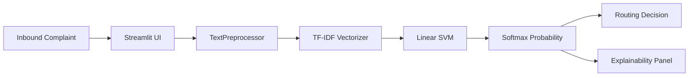
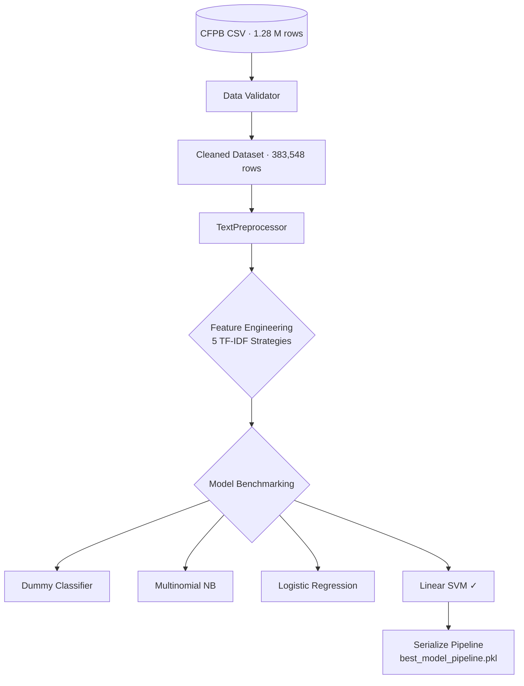

# Financial Complaint Intelligence Platform


An end-to-end NLP classification pipeline that automatically reads raw consumer financial complaints and routes them to the correct operational department — from data ingestion through interactive deployment.

---

## Business Problem

The Consumer Financial Protection Bureau (CFPB) receives **millions** of consumer complaints annually.  Each complaint must be read by a human, interpreted, and manually assigned to the correct financial product team (Credit Cards, Mortgages, Debt Collection, etc.).

This project **eliminates the manual routing bottleneck** by training a text classifier on 1.2 M+ historical complaints and deploying it behind a professional dashboard where support agents can paste a complaint and receive an instant, explainable routing decision.

---

## Dataset Overview

| Attribute | Value |
|---|---|
| Source | [CFPB Consumer Complaint Database](https://www.consumerfinance.gov/data-research/consumer-complaints/) |
| Total Records | 1,280,000+ |
| Cleaned Records | 383,548 |
| Input Feature | `Consumer complaint narrative` (free-text) |
| Target Feature | `Product` (17 retained classes after rare-class filtering) |
| Key Challenges | Severe class imbalance · high vocabulary overlap between classes · noisy user-generated text |

---

## System Architecture



### ML Training Pipeline



---

## Feature Engineering

Five TF-IDF vectorisation strategies were compared empirically:

| Strategy | Vocabulary | Sparsity |
|---|---|---|
| Unigrams | ~120 k | 99.6 % |
| Uni + Bigrams | ~1.1 M | 99.9 % |
| **Max 10 k features (selected)** | **10 000** | **98.4 %** |
| Stopword removal | ~120 k | 99.6 % |
| Sublinear TF | ~120 k | 99.6 % |

The **10 000-feature bigram cap** was selected for production: it captures important multi-word phrases (e.g. "credit card", "debt collection") while keeping the feature matrix small enough for fast training and inference.

---

## Model Comparison

All linear models were trained with `class_weight='balanced'` to mitigate severe class imbalance, followed by GridSearchCV hyperparameter tuning on the regularisation parameter `C`.

| Model | Accuracy | Precision | Recall | Macro F1 | Weighted F1 | Train Time |
|---|---|---|---|---|---|---|
| Dummy (Most-Frequent) | 24.09 % | 5.80 % | 24.09 % | 2.28 % | 9.35 % | 0.19 s |
| Multinomial Naive Bayes | 69.34 % | 68.89 % | 69.34 % | 43.06 % | 66.79 % | 1.40 s |
| Logistic Regression | 71.27 % | 74.93 % | 71.27 % | 56.65 % | 72.27 % | 155.11 s |
| **Linear SVM** | **72.77 %** | **74.19 %** | **72.77 %** | **55.91 %** | **73.27 %** | **272.82 s** |

**Key insight:** Adding `class_weight='balanced'` significantly improved performance on minority classes. The baseline Linear SVM achieved the best overall performance, outperforming the tuned version and logistic regression.

---

## Explainability

The system provides **per-prediction explainability** by extracting the Linear SVM coefficient vector for the predicted class and intersecting it with the TF-IDF features present in the user's document.

- **Positive coefficients** = keywords that supported the routing decision.
- **Negative coefficients** = keywords that pushed the model away from the predicted class.

This is visualised interactively using a Plotly horizontal bar chart in the dashboard.

---

## Quick Start

```bash
# 1. Install dependencies
pip install -r requirements.txt

# 2. Train the pipeline (generates model + reports)
python run_training.py

# 3. Launch the dashboard
streamlit run app.py
```

---

## Project Structure

```
├── app.py                        # Streamlit dashboard (dark enterprise theme)
├── run_training.py               # Training orchestration
├── requirements.txt              # Dependency pinning
├── rows.csv                      # CFPB dataset (not committed)
├── .github/workflows/ci.yml      # GitHub Actions CI (lint + smoke tests)
├── models/
│   └── best_model_pipeline.pkl   # Serialised prediction pipeline
├── reports/
│   ├── metrics.json              # Production metrics (loaded by UI)
│   ├── benchmark_results.csv     # Full benchmark table
│   ├── feature_engineering_report.md
│   ├── explainability_report.md
│   └── figures/
│       ├── benchmark_comparison.png
│       ├── benchmark_all_metrics.png
│       ├── class_distribution.png
│       ├── cm_logistic_regression.png
│       └── ...
├── src/
│   ├── data/
│   │   ├── loader.py             # Data ingestion & splitting
│   │   └── validator.py          # Cleaning & rare-class filtering
│   ├── features/
│   │   └── preprocessor.py       # Custom sklearn transformer
│   ├── models/
│   │   ├── train.py              # Model registry & TF-IDF experiments
│   │   └── evaluate.py           # Metric computation & CM plotting
│   └── explain/
│       └── explainer.py          # Per-class keyword extraction
└── screenshots/
    └── INSTRUCTIONS.md
```

---
- Implemented CI/CD via GitHub Actions with flake8 linting and import smoke tests, pinned dependencies via `requirements.txt` for reproducible builds.
